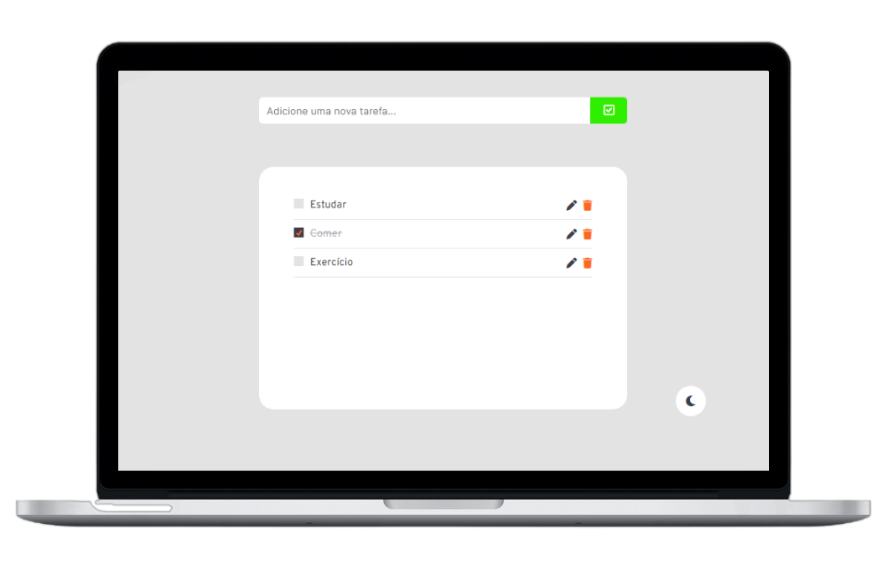

<p  align="center">
    
</p>

 <p align='center'>
    
    
</p>

<div  align='center'>
    
</div>


## 📝 Introdução
**What to do?** é uma aplicação web para listagem de tarefas diárias. O usuário pode remover, adicionar e marcar as atividades que desejar e consultá-las posteriormente.
## ✨ Layout
Você pode conferir o layout no Figma através desse [link](https://www.figma.com/file/QJnlmxH05K42fhGfpL8JtN/Untitled-(Copy)?node-id=1%3A2), ao longo do projeto fiz pequenas mudanças.

## 🔩 Tecnologias
- HTML
- SASS
- Javascript
## 🎯 Funcionalidades

- [X] Adicionar tarefa
- [X] Excluir tarefa
- [X] Estado de tarefa concluída
- [X] Armazenar tarefas no Local Storage
- [X] Dark-mode
- [X] Responsividade para todos os dispositivos
- [ ] Animações ao adicionar e apagar tarefas
- [ ] Atualizar tarefas

## 👷‍♂️ Como usar?

```
# Clone o repositório ou faça um fork
$ git clone https://github.com/Pedrovinhas/what-to-do

# Acesse a pasta do projeto
$ cd what-to-do

# Abra a pasta do projeto no vscode
$ code .

# Rode a aplicação com o Live Server
```

## 📝 License
Esse projeto é licenciado pela MIT License. Veja mais detalhes por [aqui](https://pt.wikipedia.org/wiki/Licen%C3%A7a_MIT)

---
<blockquote> Feito por Pedro Henrique Vinhas 🪐 </blockquote>
